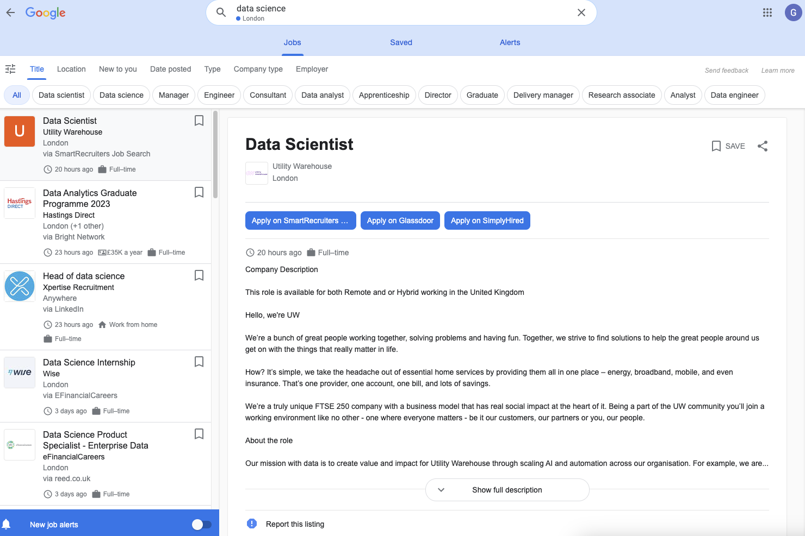
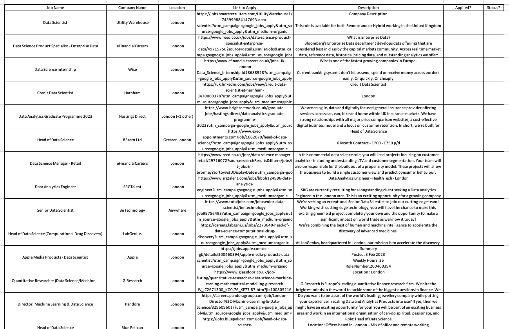
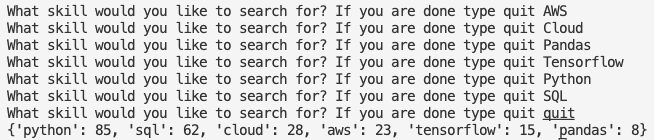

<h2 align="center">Web-Scraping Google Jobs</h2>

**Technologies Used**: Selenium, Python, Git, Docker & OpenPyxl

	
	
	
	
	

<h4 align="left">Introduction</h4>

 Job searching is a notoriously time-consuming process and searching for jobs in tech confounds this issue. With each job requesting a unique tech stack, it can be difficult to manually parse through this data to find the best suited jobs for you to apply to. This program tries to alleviate some of these issues by scraping job postings from Google Jobs for a specified search query, processes the data, analyses the data and stores it in a  Excel spreadsheet. I chose Google Jobs over other viable options as I find it has the best job search capabilities; it only returns job postings for exactly what you search 

<h4 align="left">Google Jobs Website</h4>

  

The Google Jobs website is a highly dynamic and pageless (infinite scroll) website that does not respond well with a regular web scraping techniques like using requests. Google have infrastructure in place so it is not possible to scrape via the back-end so in order to properly scrape the data, rather than attempting to call the back-end server for information, we must simulate a front-end user with Selenium and Chrome-Driver.

In order to make my code versatile the scraper begins by asking the user for a job search query, including what job, what location and what radius to search in. 

<h4 align="left">Scraping the Data </h4>

My first script, the scraper [script](https://github.com/gabriella-martin/Web-Scraping/blob/main/project/data_scraper.py), does the following:

- Initialises the scraper by setting up the ChromeDriver, this runs in headless mode with our predetermined search query
- Accepts the cookies button for us 
- Click on the user's inputted location and radius
- Scrolls down the page until all the postings have been loaded
- Scrapes all relevant information from each job posting
- Pickles this as a list for use in the next step

🫙 Pickling between steps (saving in local storage) ensures I was able to process the data without recalling the entire scraper class which helps us saves time as the entire scraping process takes a few minutes as we have to allow things to load like a front-end user would have to. This also avoids our IP address from being banned by Google for unusual behaviour.

<h4 align="left"> Processing the Data </h4>

The data processing [script](https://github.com/gabriella-martin/Web-Scraping/blob/main/project/data_processing.py) cleans and processes the data and adds it a an Excel spreadsheet. Here in excel I can customisably track each job for example I can delete those that I am not interested in, track application status and add any relevant follow on details.Here is an example of a search I did for a friend who was looking at data science jobs in London, the export to excel process happens automatically when the program is ran.

  

<h4 align="left"> Analysing the Data</h4>

In my final [script](https://github.com/gabriella-martin/Web-Scraping/blob/main/project/data_analysis.py) data analysis, I wanted to analyse the job requirements for specific roles at the aggregate level to explore market wide information. Scraping Google Jobs over say Indeed or Linkedin was important for achieving a solid analysis as unlike the other options, Google Jobs returns only specifically what you search for, if you ask for only internships thats all they will provide you with. The job of this script is to analyse the tech stacks for certain job roles and have a guideline for what technology is most in demand for employers in each specific role. For data science, I can ask about the prominance of each skill and my script will return an ordered list of percentage prominance for each skill. The prominance calculate by what percent of all the scraped job postings include the term in their description

Here is an example of this in action:

  

<h4 align="left"> Unit-Testing & Containerisation</h4>

Next, I wrote unit-tests covering each public method to ensure my code runs smoothly. The code for the tests can be found [here](https://github.com/gabriella-martin/Web-Scraping/tree/main/tests).

It is then contained with a Docker image to allow others to use and also published as a package. 